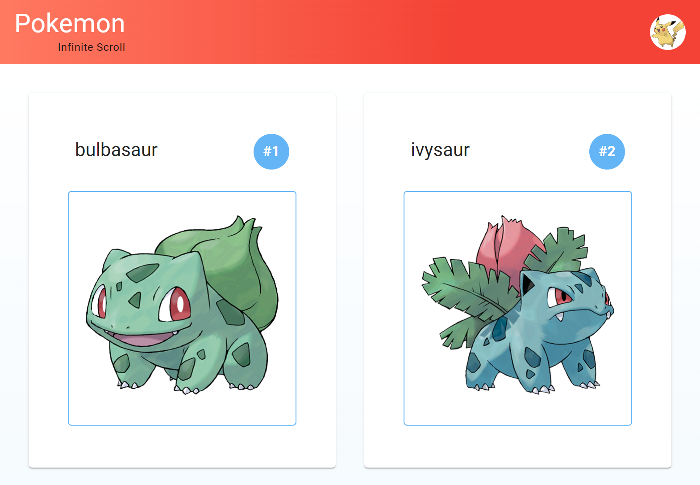

# Pokémon Infinite Scroll 🌱

> A web application that allows you to browse through Pokémon with an infinite scrolling feature.

  <!-- Replace with your app screenshot -->

## Features 🌟

- **Infinite Scrolling**: As you scroll down, more Pokémon appear!
- **Responsive**: Adapts to various screen sizes.
- **Fast Loading**: Efficient data fetching for optimal performance.

## Tech Stack 🛠️

- React.js
- Vite
- MUI (Material UI)
- Intersection Observer API

## Prerequisites 📦

- Node.js >=18.2
- npm >=6.x
- Git

## Installation 💻

### Clone the Repository

```bash
# Via HTTPS
git clone https://github.com/jwrigh26/pokemon-infinite-scroll.git

# Or via SSH
git clone git@github.com:jwrigh26/pokemon-infinite-scroll.git
```

### Navigate to Project Directory

```bash
cd pokemon-infinite-scroll
```

### Install Dependencies

```bash
npm install
```

### Start the Development Server

```bash
npm run start
```

Now, open `http://localhost:3000/` in your browser. You should see the app running.

## Contributing 🤝

Feel free to send a PR! We welcome all sorts of contributions.

## License 📃

MIT

---

Copy this markdown into your README.md file, and don't forget to replace the screenshot placeholder with an actual screenshot of your application for a nice visual touch.
